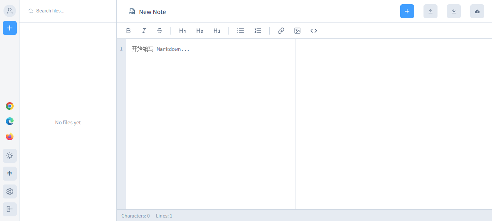

# Cnotely — 网页版笔记编辑器（Web Notes Editor）

> 一个基于 Vue 3 + TypeScript + Vite 构建的现代化笔记 / Markdown 编辑平台。
> A modern note & Markdown editing platform built with Vue 3, TypeScript and Vite.



Cnotely 是 [cnotely](https://www.cnotely.com) 知识管理系统中的网页版笔记编辑器，提供三种编辑器（富文本 / Markdown / 纯文本）、多种导出格式、云端同步与多语言界面。

---

## ✨ 功能特性

### 编辑

- **三种编辑器模式**：富文本（wangEditor）、Markdown、纯文本，可在工具栏随时切换
- **实时预览**：Markdown 实时渲染
- **明暗主题**：支持浅色 / 深色主题切换，编辑器独立配置
- 快捷键与丰富的工具栏

### 导出

一键导出为多种格式：

| 格式      | 说明                      |
| --------- | ------------------------- |
| `.md`   | Markdown 源文件           |
| `.pdf`  | PDF 文档（客户端生成）    |
| `.html` | HTML 页面（可选主题样式） |
| `.docx` | Word 文档                 |
| `.txt`  | 纯文本                    |

### 云端存储

- **GitHub** OAuth 授权（PKCE + client_secret / CF Worker 服务端补密）
- **Google Drive** OAuth 授权（纯 PKCE，前端直连）
- 笔记内容同步到云端，支持导入 / 导出 / 分享

### 其他

- **多语言界面**：中文 / English
- **浏览器扩展支持**：Chrome / Edge / Firefox（划词收藏、右键收藏）
- **本地存储**：IndexedDB，本地优先
- Element Plus 组件库

---

## 🛠 技术栈

| 类别     | 技术                                             |
| -------- | ------------------------------------------------ |
| 前端框架 | Vue 3（Composition API）                         |
| 语言     | TypeScript                                       |
| 构建工具 | Vite 5                                           |
| 路由     | Vue Router 4                                     |
| 国际化   | Vue I18n                                         |
| UI 组件  | Element Plus                                     |
| 富文本   | wangEditor                                       |
| 云端     | GitHub OAuth / Google Drive / Cloudflare Workers |

---

## 🚀 快速开始

### 环境要求

- Node.js 18+
- npm

### 安装与运行

```bash
# 1. 克隆项目
git clone git@github.com:itcwc/cnote-web.git
cd cnote-web

# 2. 安装依赖
npm install

# 3. 本地开发（默认 http://localhost:5174）
npm run dev

# 4. 生产构建
npm run build
```

> 本地默认端口为 `5174`（可在 `vite.config.ts` 中调整）。

### 环境变量

复制 `.env.example` 为 `.env.*` 并根据需要填写：

```bash
cp .env.example .env.development
```

| 变量                            | 说明                                               |
| ------------------------------- | -------------------------------------------------- |
| `VITE_APP_NAME`               | 应用名称                                           |
| `VITE_GITHUB_CLIENT_ID`       | GitHub OAuth Client ID（公开）                     |
| `VITE_GOOGLE_CLIENT_ID`       | Google OAuth Client ID（公开）                     |
| `VITE_TURNSTILE_SITE_KEY`     | Cloudflare Turnstile Site Key                      |
| `GITHUB_CLIENT_SECRET`        | 仅开发环境（vite proxy 自动追加，不会进入前端）    |
| `VITE_GITHUB_TOKEN_PROXY_URL` | 生产环境 Cloudflare Worker 地址（服务端补 secret） |

> ⚠️ `client_secret` 属于敏感信息，**永远不会打入前端产物**。开发环境由 vite proxy 中转，生产环境由 Cloudflare Worker 在服务端完成 OAuth 换取 token。

---

## 📁 项目结构

```
cnote-web/
├── public/                  # 静态资源
├── src/
│   ├── api/                 # 云端 API（GitHub / Google Drive）
│   ├── assets/              # 资源
│   ├── components/          # 组件
│   │   └── layout/          # 布局（侧边栏、编辑器面板）
│   ├── composables/         # 组合式函数（主题、存储等）
│   ├── locales/             # 国际化语言文件
│   ├── router/              # 路由配置
│   ├── utils/               # 工具函数 / IndexedDB
│   ├── views/               # 页面（编辑器、设置、OAuth 回调）
│   ├── App.vue
│   └── main.ts
├── functions/               # Cloudflare Functions（OAuth 代理）
├── worker/                  # Cloudflare Worker（GitHub OAuth 换取 token）
├── index.html
├── vite.config.ts           # Vite 配置
└── wrangler.jsonc           # Cloudflare 部署配置
```

---

## 🔐 安全说明

- 所有 OAuth `client_secret` 均保存于服务端（Cloudflare Worker / Functions），前端只会拿到公开的 `client_id`。
- 本地开发时通过 `vite-plugin-github-proxy.ts` 中转补 secret，避免密钥进入浏览器。

---

## 🌐 部署

- 前端静态资源可部署到任意静态托管（Cloudflare Pages / Vercel / Nginx）。
- OAuth 的 `token` 换发需在 Cloudflare Worker 中配置（见 `worker/` 目录与 `wrangler.jsonc`）。

---

## 📄 许可证

[MIT](./LICENSE)

---

## 🙏 贡献

欢迎提交 Issue 与 Pull Request。本仓库由 [cnotely](https://www.cnotely.com) 开源，联系我：[ support@cnotely.com](mailto:support@cnotely.com)。

* [Contact us: support@cnotely.com](mailto:support@cnotely.com)
